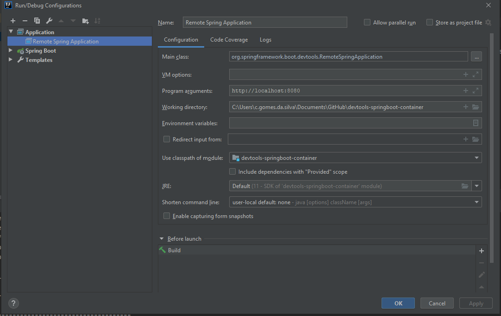

# devtools-springboot-container
Project that demonstrates how to use Docker integration with SpringBoot's DevTools

* Make sure Docker installed and running

``
Docker info
``

Run the command below to create an image of the project:

``
./mvnw spring-boot:build-image
``

Run the command below to start the container:

``
docker run --rm --tty --publish 8080:8080 devtools-springboot-container:1.0.0
OR
docker run --restart=always --tty --publish 8080:8080 devtools-springboot-container:1.0.0
``

Perform the configuration shown in the image to remotely access the application and run the application using this configuration.

Perform the test in the application:

``
curl http://localhost:8080/universe
``
*Make a change to the controller to your liking and redo the build.

Run the test on the application again:
``
curl http://localhost:8080/universe
``

if everything goes according to schedule, you will have the update published.